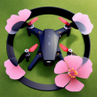

# FPVGate

FPVGate is a project that aims to create a gate system for detecting the passage of drones (mainly tinywhoops) using ultrasonic sensors. The gate system is designed for FPV (First Person View) racing and can be used as a starting and finishing line for races.

## Features

- Starter functionality: One gate is designated as the starter gate, which initiates the race and records the lap times.
- Gate detection: Ultrasonic sensors are used to detect the passage of objects through the gates.
- Configurable threshold distance: The threshold distance can be adjusted to fine-tune the detection sensitivity.
- Web-based user interface: Provides a user-friendly interface for configuring and monitoring the gate system (not implemented yet).

# TODO
- Led Strip : 23 (Data), 22 (Clock)
- Supporting OTA updates

## Requirements

To use FPVGate, the following components are required:

* Arduino-compatible board (ESP32 or ESP8266)
* HC-SR04 ultrasonic sensors
* RGB LED (optional)
* Buttons
* Batteries (18650)
* Buzzer
* Lcd Display (SSD1306)

## Installation

1. Clone FPVGate repository
2. Install the required libraries and dependencies as specified in the documentation.
3. ???
4. Profit !

## Wiring

Common:

* Ultrasonic sensor: 33 (Trigger), 25 (Echo)
* Potentiometer (for ultrasonic range calibration): 36
* State led: 2
* Buzzer : 27

Starter :

* reset button : 12
* Lcd display : 21 (SDA), 22 (SCL)

## Project

One gate must be the **Starter** gate, it will:

- Create a WiFi access point
- Receive information when a gate detects a passage
- Orchestrate other gates

Others **Gates** can:

* Access to the Starter's WiFi access point
* Register when joining network
* Notify **Starter** when detecting object's passage

## Configuration

**Starter Gate** has 4 modes: NONE, CALIBRATION, TRACK and RACE.

- IDLE : Default mode when starting devices (does nothing)
- CALIBRATION : All registered gates are listening and continue to listen when a passage is detected. Allow the user to calibrate the ultrasonic sensor's range using the potentiometer.
- TRACK MODE : All registered gates are listening. When a drone passes a gate, **Starter** is notified and gates' order is kept in memory.
- RACE MODE : Once **Starter** is passed, RACE mode is activated.

## License

FPVGate is licensed under the MIT License.

## Acknowledgements
